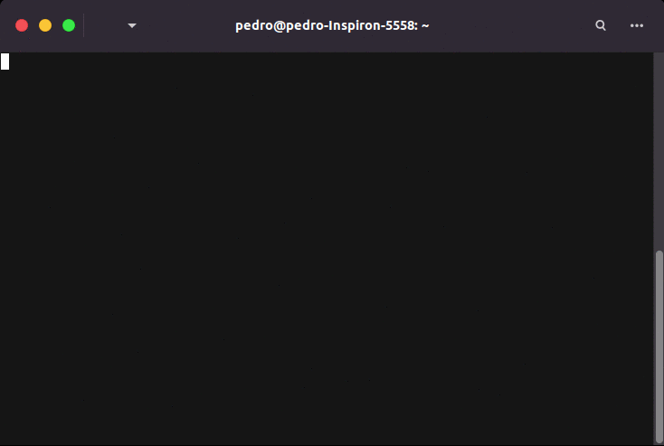

# MONITORING
*A simple web service monitoring application*
# Description
This project is a web monitoring program written in C to get status from three protocols: PING, HTTP and DNS. The information acquired is stored in `monitoring.log` file inside the program folder and a simplify version is printed in the terminal.

# Usage
### Requirements


Monitoring requires a gcc compiler, standard C libraries, and it runs only in Linux system (only Ubuntu was tested).

### Install

Run `make` command in the repository folder:

	$> make

Make supports the following commands:

> - `make` - compile the project;
> - `make clog` - remove log file
> - `make clean` - remove all objects (`.o`) files;
> - `make fclean` - perform clean and also remove its dependencies and executable file;
> - `make re` - recompile project.


### Configuration

Monitoring reads the instructions in the **monitoring.db** file located in the repository folder, which must be formatted as follows:

| Protocol  |  Configurations |
| :-----: | --------- |
| PING | name, protocol, address, interval |
| DNS | name, protocol, address, interval, dns server |
| HTTP | name, protocol, address, http method, expected http code, interval | 

Each service must be separated by lines and the configuration by coloumns separated by tab, as shown below:

```
 # monitoring.db

ping test	PING	example.com	5
dns test	DNS	example.com	10	8.8.8.8
http test	HTTP	example.com	GET	200	30
```

### Run

Just excecute in the command line:

	$> ./monitoring

During execution, simplified informations about the services are displayed in terminal:



If you want to recover the simplified output from previous monitoring execution, run with the flag `--simplify`

	$> ./monitoring --simplify

# Roadmap

- [ ] Unhealthy service notification (Discord, email, Slack and/or Webhook)
- [ ] Identification of incomun services behaviour, such as ping latency increase
- [ ] TCP and MQTT monitoring
- [ ] Unix-lile parsing arguments to filter and modify program behaviour
- [ ] Aggregate data from `monitoring.log` with diagrams, graphs, and CLI

# Support

If you have any trouble or find any issues send me an e-mail: pe.pn03@gmail.com
